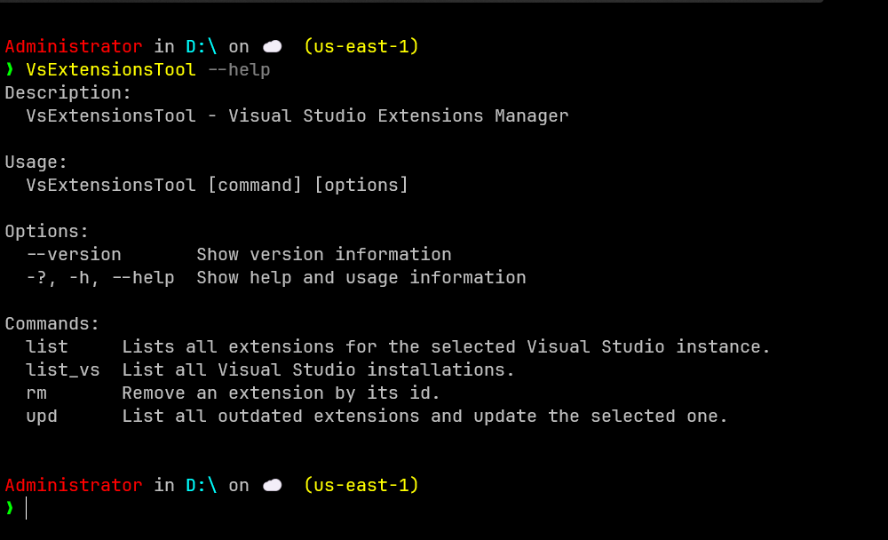
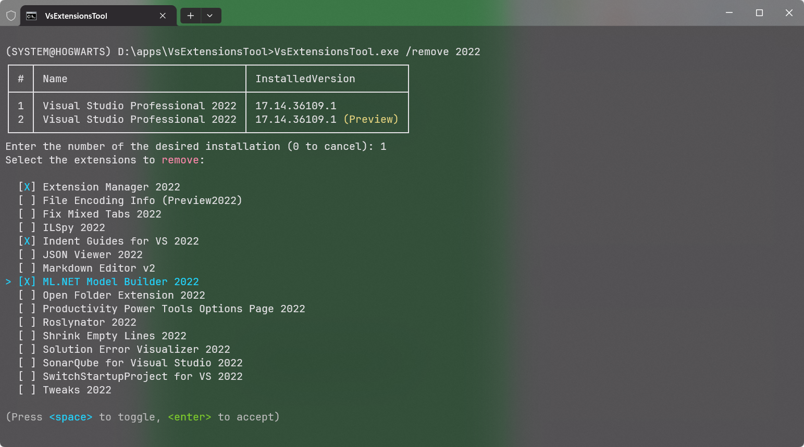

# VsExtensionsTool


[](https://codecov.io/gh/dougcunha/VsExtensionsTool)
[](LICENSE)


## Table of Contents

- [Motivation](#motivation)
- [Features](#features)
- [Marketplace API Disclaimer](#marketplace-api-disclaimer)
- [Installation](#installation)
- [Usage](#usage)
- [Screenshots](#screenshots)
- [Dependencies](#dependencies)
- [Contributing](#contributing)
- [License](#license)

## Motivation

I created this tool because I often struggled to remove extensions from Visual Studio. Many times, after marking an extension for removal and restarting Visual Studio, the extension would remain installed. The only reliable way I found to remove extensions was by using the VSIXInstaller manually. This tool automates and simplifies that process.

I do not plan to add support for VSCode, as its extension management interface is already excellent and adding support would not provide significant value. This project is focused exclusively on Visual Studio.

## Features

- List all Visual Studio installations
- List installed extensions, with optional filtering by name or id
- Show installed version and latest version available on the Marketplace
- Remove extensions by id or interactively
- Update extensions
- Beautiful and interactive console output powered by [Spectre.Console](https://spectreconsole.net/)

## Marketplace API Disclaimer

This tool uses a non-public, undocumented API from the Visual Studio Marketplace to retrieve the latest available version of extensions. The API endpoint and its contract are not officially supported by Microsoft and may change or stop working at any time, without notice. The initial implementation of VsExtensionsTool was based on API version `3.2-preview.1`.

If the Marketplace version check stops working, it is likely due to changes in this unofficial API.

## Installation

1. Clone the repository:

   ```sh
   git clone https://github.com/dougcunha/VsExtensionsTool.git
   cd VsExtensionsTool
   ```

2. Restore NuGet packages:

   ```sh
   dotnet restore
   ```

3. Build the project:

   ```sh
   dotnet build -c Release
   ```

4. Publish as single-file

    ```sh
    dotnet publish -c Release -o C:\output\
    ```

## Usage

Now the commands use the modern System.CommandLine syntax, with intuitive names and aliases:

```sh
VsExtensionsTool.exe list-vs
VsExtensionsTool.exe list [--filter <name-or-id>] [--version] [--outdated]
VsExtensionsTool.exe rm [--id <id>] [--filter <name-or-id>]
VsExtensionsTool.exe upd
```

### Commands and options

- `list-vs` : Lists all Visual Studio installations
- `list` : Lists extensions for the selected instance
  - `--filter`, `-f`, `/filter` : Filter by extension name or id
  - `--version`, `-v`, `/version` : Show latest Marketplace version
  - `--outdated`, `-o`, `/outdated` : Show only outdated extensions
- `rm` : Remove an extension
  - `--id`, `-i`, `/id` : Id of the extension to remove
  - `--filter`, `-f`, `/filter` : Filter extensions for interactive selection
- `upd` : Lists all outdated extensions and allows you to update the selected ones

Examples:

```sh
VsExtensionsTool.exe list-vs
VsExtensionsTool.exe list --filter="ReSharper" --version
VsExtensionsTool.exe rm --id="Company.ExtensionId"
VsExtensionsTool.exe upd
```

## Screenshots

### Help



### Listing Extensions


### Removing Extension



### Updating Extension


## Dependencies

This project uses [Spectre.Console](https://spectreconsole.net/) to provide rich and interactive console output. Many thanks to the Spectre.Console team and contributors for their amazing work!

## Contributing

Contributions are welcome! Please open an issue or submit a pull request.

## License

MIT. See the [LICENSE](LICENSE) file.
